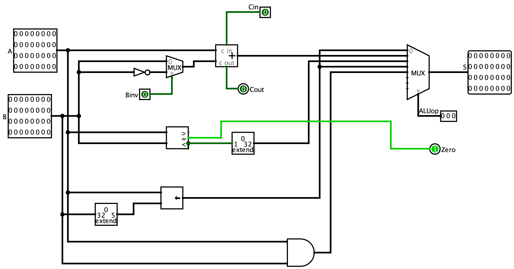

# 18bitInstructionRISCProcessor
**Instruction Set Architecture**

**Done by: Labib Rahman**

**Usage:** 
Download [Logisim](http://cburch.com/logisim/download.html) digital logic simulation tool and run 18bitInstructionRISCProcessor.circ file. Load HEX values for LED matrix display for opcode mnemonic to work. 

**Introduction:**

The CPU designed here is of RISC type and has an instruction width of 18 bits and can perform different arithmetic and logical operations on 32 bit data.

**Assembler:**

The assembler takes assembly language as input which is generated by the compiler of a high-level programming language. This input is then converted into machine language which is in hexadecimal form. This instruction is then fed to the instruction memory in the ROM of our CPU.

**Components used:**

- Logical gates
- Decoders
- Bit extenders
- Adder circuits
- Binary shifters
- Multiplexers
- RAM and ROM
- LED matrix and different wiring for connections

**Circuit diagrams and tables:**


Diagram 1: Overall data path


Diagram 2: Register file



Diagram 3: ALU


Diagram 3: Control Unit signals

Table 1: Control Unit signal table
| Opcode | Mnemonic | Operation | ALUop | Bin | Cin | Write reg | Mem2reg | ALU src(Rt/Im) | RegDst | Str/Mem write | Ld/Mem read | j | beq |
| --- | --- | --- | --- | --- | --- | --- | --- | --- | --- | --- | --- | --- | --- |
| 000000 | nop | No operation | 000 | 0 | 0 | 1 | 0 | 1 | 1 | 0 | 0 | 0 | 0 |
| 000001 | sw | Store word | 001 | 0 | 0 | 0 | 0 | 1 | 0 | 1 | 0 | 0 | 0 |
| 000010 | addi | Add immediate | 001 | 0 | 0 | 1 | 0 | 1 | 1 | 0 | 0 | 0 | 0 |
| 000011 | lw | Load word | 001 | 0 | 0 | 1 | 1 | 1 | 1 | 0 | 1 | 0 | 0 |
| 000100 | beq | Branch on equal | 111 | 0 | 0 | 0 | 0 | 0 | 0 | 0 | 0 | 0 | 1 |
| 000101 | add | Add | 001 | 0 | 0 | 1 | 0 | 0 | 0 | 0 | 0 | 0 | 0 |
| 000110 | slt | Set less than | 010 | 0 | 0 | 1 | 0 | 0 | 0 | 0 | 0 | 0 | 0 |
| 000111 | sll | Shift left | 011 | 0 | 0 | 1 | 0 | 1 | 1 | 0 | 0 | 0 | 0 |
| 001000 | sub | Subtract | 001 | 1 | 1 | 1 | 0 | 0 | 0 | 0 | 0 | 0 | 0 |
| 001001 | jmp | Jump | xxx | 0 | 0 | 0 | 0 | 0 | 0 | 0 | 0 | 1 | 0 |
| 001010 | and | And | 100 | 0 | 0 | 1 | 0 | 0 | 0 | 0 | 0 | 0 | 0 |


**Operands:**

This RISC processor uses instructions of 3 formats.

1) R-type:

| Op-code (6 bit) | Rs (4 bit) | Rt (4 bit) | Rd (4 bit) |
| --- | --- | --- | --- |


2) I type:

| Op-code (6 bit) | Rs (4 bit) | Rt/Rd (4 bit) | Immediate value (4 bit) |
| --- | --- | --- | --- |

3) J type:

| Op-code (6 bit) | Jump target address (12 bit) |
| --- | --- |
# Registers

| **Register Number** | **Name of the Registers** | **Usage** | **Value Assigned (4 bit)** |
| --- | --- | --- | --- |
| 0 | R0 | Constant value 0 | 0000 |
| 1 | R1 | General purpose | 0001 |
| 2 | R2 | General purpose | 0010 |
| 3 | R3 | General purpose | 0011 |
| 4 | R4 | General purpose | 0100 |
| 5 | R5 | General purpose | 0101 |
| 6 | R6 | General purpose | 0110 |
| 7 | R7 | General purpose | 0111 |
| 8 | R8 | General purpose | 1000 |
| 9 | R9 | General purpose | 1001 |
| 10 | R10 | General purpose | 1010 |
| 11 | R11 | General purpose | 1011 |
| 12 | R12 | General purpose | 1100 |
| 13 | R13 | General purpose | 1101 |
| 14 | R14 | General purpose | 1110 |
| 15 | R15 | General purpose | 1111 |

**Operations :**

**R-Type Table**

| **Instruction Type** | **Instruction** | **Op-Code** |
| --- | --- | --- |
| Arithmetic | add | 000101 |
| Logical | slt | 000110 |
| Arithmetic | sub | 001000 |
| Logical | and | 001010 |

**I-Type Table**

| **Instruction Type** | **Instruction** | **Op-Code** |
| --- | --- | --- |
| Logical | nop | 000000 |
| Data Transfer | sw | 000001 |
| Arithmetic | addi | 000010 |
| Data Transfer | lw | 000011 |
| Conditional Branch | beq | 000100 |
| Logical | sll | 000111 |

**J-Type Table**

| **Instruction Type** | **Instruction** | **Op-Code** |
| --- | --- | --- |
| Unconditional Jump | jmp | 001001 |

**Operations&#39; Instructions**

**Note:** The assembly language is written with the destination register being specified first but the instruction generated by the assembler and ultimately processed by the CPU, has the destination specified at the last for R type instructions and in the middle for certain I type instructions. To display the mnemonics on the LED matrix, HEX values for the rows must be loaded into the ROM.

**nop:**


Syntax: nop rx rx rx, nop _constant_

**Example usage:**

Instruction: nop R1 R2 R3, nop 5

Output from assembler: (0000)<sub>16</sub>

Description: Performs logical shift left on R0 by 0 bits which ultimately does not change the value of our constant value R0 register

**sw:**


Syntax: sw rs rd _immediate value_

**Example usage:**

Instruction: sw R1 R2 4

Output from assembler: (1214)<sub>16</sub>

Description: The contents of R1 are stored in the memory address generated by adding the content of R2 and 4.

**addi:**


Syntax: addi rs rd _immediate value_

**Example usage:**

Instruction: addi R1 R2 6

Output from assembler: (2216)<sub>16</sub>

Description: The contents of R2 and 6 are added together, the value of which is stored in R1

**lw:**


Syntax: lw rs rd _immediate value_

**Example usage:**

Instruction: lw R1 R2 3

Output from assembler: (3213)<sub>16</sub>

Description: It loads the contents of the memory specified by the offset and saves it into the destination register R1.

**beq:**


Syntax: beq rs rt _immediate value_

**Example usage:**

Instruction: beq R1 R2 8

Output from assembler: (4218)<sub>16</sub>

Description: Checks if the content of the register R1 is equal to the contents of register R2. If equal it performs a jumps to the instruction number specified by the immediate field.

**add:**


Syntax: add rd rs rt

**Example usage:**

Instruction: add R1 R2 R3

Output from assembler: (5231)<sub>16</sub>

Description: The contents of R2 and R3 are added together the value of which is stored in R1

**slt:**


Syntax: slt rs rt rd

**Example usage:**

Instruction: slt R1 R2 R3

Output from assembler: (6231)<sub>16</sub>

Description: The contents of R2 and R3 are compared. If content of R2 is less than the content stored in R3, R1 is set to 1 or else it is set to 0.

**sll:**


Syntax: sll rs rd _constant_

**Example usage:**

Instruction: sll R2 R1 5

Output from assembler: (7215)<sub>16</sub>

Description: Performs logical shift left on R1 the amount of which is found by adding the contents of R2 and 5.

**sub:**


Syntax: sub rd rs rt

**Example usage:**

Instruction: sub R1 R2 R3

Output from assembler: (8231)<sub>16</sub>

Description: The contents of R2 and R3 are subtracted, the value of which is stored in R1

**jmp:**


Syntax: jmp _constant_

**Example usage:**

Instruction: jmp 5

Output from assembler: (9005)<sub>16</sub>

Description: Jumps to instruction address number 5

**and:**


Syntax: and rd rs rt

**Example usage:**

Instruction: and R1 R2 R3

Output from assembler: (a231)<sub>16</sub>

Description: Performs logical AND operation on the contents of R2 and R3 the value of which is stored in R1

**Example usage of a high-level programming executed using this processor:**

**Code:**
```java
int i = 0;
int b = 0;
for(; i < 10; i++){
    b += i;
}
```


**Equivalent assembly language assuming i is stored in R5 and b is stored in R7:**

| **Memory address** | **Instruction** |
| --- | --- |
| 0000 | lw R5 R0 10 |
| 0001 | lw R7 R0 11 |
| 0002 | addi R8 R0 10 |
| 0003 | beq R8 R5 3 |
| 0004 | add R7 R5 R7 |
| 0005 | addi R5 R5 1 |
| 0006 | jmp 3 |

**Equivalent machine language as generated by Python assembler:**

| **Memory address** | **Instruction** |
| --- | --- |
| 0000 | 305A |
|0001 | 307B|
| 0002 | 208A|
| 0003 | 4583|
| 0004 | 5577|
| 0005 | 2551|
| 0006 |9003|

# Discussion:

While this CPU can perform a number of operations, few of its limitations and future improvements need to be addressed. For one, we have a very limited number of operations while there is the space for more as we have allocated 6 bits for the opcode. Shift amount and functions fields have been omitted. Few of the basic operations such as multiplication and division do not exist for this processor which can be added in the future. R0 is supposed to be a hardwired constant 0 yet its contents can be changed which is not desirable. More registers and their roles can be added so that they can perform more specialized functions. This is a single cycle data path which performs 1 instruction per cycle. If it were a pipelined architecture multiple instructions could be executed in 1 cycle reducing number of cycles.

**Python code for assembler is included**
